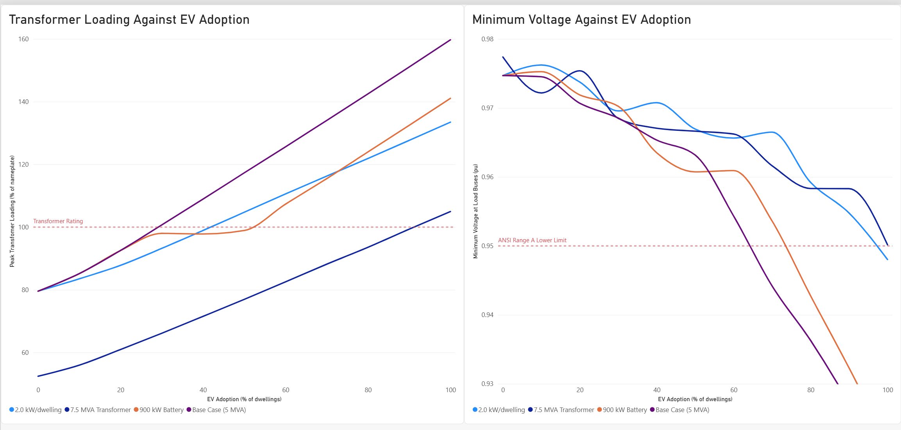
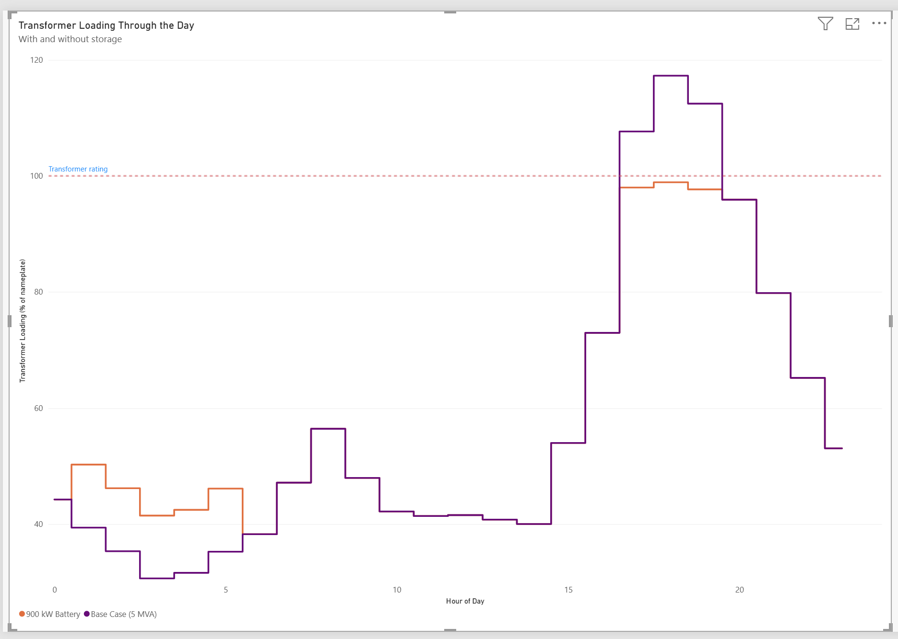

# EV Hosting Capacity of a Residential Distribution Feeder

How many electric vehicles can a distribution feeder absorb before it violates
voltage or thermal limits? And can a battery defer the upgrade?

Built in OpenDSS, driven from Python, on the IEEE 123-bus test feeder with an
Alberta load profile.

---

## Headline result

| Case | Hosting capacity | Vehicles | Binding constraint |
|---|---|---|---|
| Feeder as built | **29%** of dwellings | ~730 | Substation transformer at 100% of 5 MVA |
| Plus a 900 kW / 2.4 MWh battery | **51%** | ~1,290 | Same, deferred |

The feeder is limited by transformer capacity, not by voltage. Voltage still
has room at 64% penetration while the transformer saturates at 29%. That is the
opposite of what most EV hosting capacity work assumes.

Two things cause it. EV load spreads across all 91 nodes instead of
concentrating at the weak end of the feeder, so it raises total current more
than it depresses any single node's voltage. And the feeder has four voltage
regulators actively holding voltage up, while nothing protects transformer
capacity.

---

## Method

**Network.** IEEE 123-bus test feeder at 4.16 kV. It has 132 buses, 278 nodes,
and 91 aggregated spot loads totalling 3,490 kW.

**Engine.** OpenDSS through OpenDSSDirect.py, scripted end to end. 4,944 solved
feeder hours across five scenarios.

**Substation transformer.** The stock model connects an ideal source straight
to bus 150, so no equipment has a nameplate rating to overload. A 5 MVA
transformer at 8% impedance and 72/4.16 kV was added. It represents this
feeder's share of substation capacity.

**Load shape.** A 24 hour residential winter weekday profile. Peak timing was
measured from AESO hourly load data for the Edmonton region, January 2024
weekdays. The peak falls at hour 17 and load stays elevated from 16:00 to
20:00. The shape is normalised so the peak hour is exactly 1.0, because the
test feeder's spot loads represent coincident peak demand rather than an
average day.

**EV model.** 7.2 kW Level 2 chargers placed on a random subset of 2,513
dwellings, at an ADMD of 1.38 kW per dwelling. Five random placements were run
at each adoption level. Charging follows a synthetic charge on arrival profile
calibrated to 10.5 kWh per vehicle per day, with a peak coincidence of 0.20 at
hour 18.

**Battery.** One unit sited at the substation and dispatched to shave the peak.
It was sized from the measured overload profile.

## Validation

The stock feeder was validated before anything was modified.

| Check | Result |
|---|---|
| Converged | Yes, all 4,944 hours |
| Bus and node count | 132 and 278 |
| Minimum voltage | 0.9747 pu at node `65.1` |
| Peak loading | 79.6% at hour 17 |
| Power balance | 3,519.3 kW of load plus 96.0 kW of losses equals 3,615.3 kW at the source. It closes to 0.1 kW. |
| Losses | 2.65% of delivered power, inside the 2% to 4% typical of primary distribution |

---

## Findings

**Thermal capacity binds first in every scenario tested.** Even with a
transformer 50% larger, voltage never violates anywhere in the swept range.

**The result is stable in vehicles and unstable in percent.** Doubling the
assumed dwellings per node moves the threshold from 29% to 42%. It moves the
vehicle count from 734 to 731. The feeder's limit is in kilowatts. The
percentage is only a denominator.

**Transformer rating dominates the answer.** 5 MVA gives 29%. 7.5 MVA gives
91%. Percent impedance is referenced to a transformer's own base, so a larger
unit also presents 33% less ohmic impedance and improves voltage at the same
time.

**EV charging creates a new peak instead of adding to the old one.** The feeder
peaks at hour 17. Charging peaks at hour 18. Above 20% penetration the system
peak moves to hour 18, and each additional EV then adds 43% more loading than
it did before. This shows up as a kink in the sweep curve.

**Storage helps thermally but can hurt voltage at moderate penetration.** The
regulators use line drop compensation, set to `R=3 X=7.5`. A substation battery
reduces the current flowing through the regulator, so the regulator infers less
downstream voltage drop and boosts less. The end of the feeder ends up slightly
lower at 40% to 50% penetration. Above 60% the thermal relief is large enough
to outweigh this.



---

## Assumptions and limitations

Each assumption below is stated with the direction it pushes the result.

### Where 2,513 dwellings comes from

The feeder's 91 spot loads total 3,490 kW. Nothing in the model says how many
homes that represents, so it has to be assumed.

The Alberta MSA study assumes 600 kWh per month per residential customer. That
works out to 20 kWh per day, or 0.83 kW on average. Turning an average into a
peak needs a load factor, and this study's own load shape has one of 0.605.

    0.83 kW / 0.605  =  1.38 kW per dwelling at coincident peak

That figure is the ADMD, or After Diversity Maximum Demand. Dividing the
feeder's total load by it gives the dwelling count.

    3,490 kW / 1.38 kW  =  2,529 dwellings

The code divides each of the 91 loads separately and rounds to whole dwellings,
which gives **2,513**. Individual loads work out to between 14 and 152
dwellings each.

Penetration is the fraction of those 2,513 dwellings that have a charger.

| Penetration | Vehicles |
|---|---|
| 10% | 251 |
| **29%** (threshold, no battery) | **734** |
| 50% | 1,256 |
| **51%** (threshold with battery) | **1,289** |
| 100% | 2,513 |

Every vehicle draws 7.2 kW while charging. Not all of them charge at once, so
the load reaching the feeder at any hour is the vehicle count multiplied by the
charging coincidence for that hour, which peaks at 0.20.

### The assumptions themselves


| Assumption | Basis | Effect on the answer |
|---|---|---|
| 5 MVA substation allocation | A 40 MVA bank divided across 8 feeders. Separately, about 3.8 MVA from the 4.16 kV getaway conductor ampacity. | Dominant. The threshold spans 29% to 91% across plausible ratings. |
| ADMD of 1.38 kW per dwelling | 600 kWh per month (Alberta MSA) divided by the measured load factor of 0.605 | Scales the percentage. Does not change the vehicle count. |
| EV peak coincidence of 0.20 | Synthetic profile, calibrated to daily energy per vehicle | **Untested and the most consequential.** EV load at the binding hour scales directly with it. A coincidence of 0.30 would move the threshold from about 29% to about 20%. |
| Load shape trough depth | Assumed. Timing measured from AESO. | Tested and found immaterial. Both limits bind at the evening peak, where the shapes are identical. |
| No secondary network | IEEE test feeders model the primary system only | **Optimistic.** It adds another 2% to 4% of voltage drop and hides service transformer thermal limits, which are usually the first real constraint. |
| 4.16 kV feeder voltage | Fixed by the benchmark | **Conservative.** Edmonton runs up to 25 kV, where the same load draws a sixth of the current and percent voltage drop falls by a factor of about 36. |
| Perfect foresight battery dispatch | Dispatch derived from a measured profile | **Optimistic.** A reactive controller would perform slightly worse. |
| Hourly resolution | Standard for planning studies | **Optimistic.** Real charging is burstier than an hour average. Sub hourly steps would raise the peaks. |
| Rooftop PV not modelled | Not applicable | PV produces nothing between 16:00 and 20:00 in an Edmonton January, so it cannot affect this result. Summer reverse flow and overvoltage is a separate study. |

The feeder also shows a standing 1.051 pu excursion at bus 1 phase B at hour 19
under baseline conditions. This comes from the modelled regulator setpoints and
the fixed capacitor banks. It is not caused by EVs and is excluded from the
thresholds. It does mean the feeder has no upper limit headroom left for
distributed generation.

---

## Repository

```
src/feeder.py       model construction and the residential load shape
src/evs.py          dwellings per spot load, charger placement, EV injection
src/solve.py        solving, and reading voltages and loading back out
src/storage.py      battery dispatch shape and Storage element
src/study.py        scenario assembly, penetration sweeps, threshold extraction
src/run_study.py    entry point
feeder/IEEE123/     IEEE 123-bus test feeder, unmodified
data/sweep_all.csv  4,944 rows in tidy long format
```

The CSV columns are `scenario`, `penetration_pct`, `seed`, `n_evs`, `hour`,
`v_min`, `v_max`, `v_min_all`, `v_max_all`, `xfmr_pct` and `converged`.

Voltage limits are assessed at load serving buses only. ANSI and CSA Range A is
a service voltage standard. Both unfiltered extremes in this model fall on
regulator terminals that have no customers connected to them.

## Running it

```bash
python -m venv venv
venv\Scripts\activate          # Windows
pip install -r requirements.txt
python src/run_study.py
```

The full sweep takes a few seconds and rewrites `data/sweep_all.csv`.
